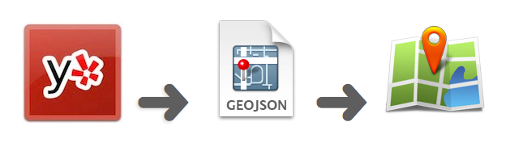

# yelp2geo

Find TERM-related places in CITY and render results as geojson or map.

That is, you can search for places falling in some category ("chinese
takeout") within some city ("Seattle") and render the geocoded location results
in [geojson](http://en.wikipedia.org/wiki/GeoJSON) format or as a map via [geojson.io](http://geojson.io).

## Usage

    yelp2geo [--in CITY] [--map] TERM

## Examples

    yelp2geo tacos
    yelp2geo --in Louisville brewpubs
    yelp2geo --in Nashville "chinese takeout"
    yelp2geo --in Milwaukee --map "bowling alleys"

## Config

You need to add your [Yelp API](http://www.yelp.com/developers/getting_started/api_overview) key and whatnot in `config.json`.

Request API access [here](http://www.yelp.com/developers/getting_started/api_access).

You can also specify your default city and search term of interest:

    {
      "consumer_key": "YOUR_YELP_CONSUMER_KEY",
      "consumer_secret": "YOUR_YELP_CONSUMER_SECRET",
      "token": "YOUR_YELP_TOKEN",
      "token_secret": "YOUR_YELP_TOKEN_SECRET",
      "default": {
        "city": "Nashville",
        "term": "tacos"
      }
    }

## Install

1. Download or clone repo.

2. Add your [Yelp API](http://www.yelp.com/developers/getting_started/api_overview) key and default prefs in `config.json`.

3. `npm -g install`

... OR ...

    npm install yelp2geo
